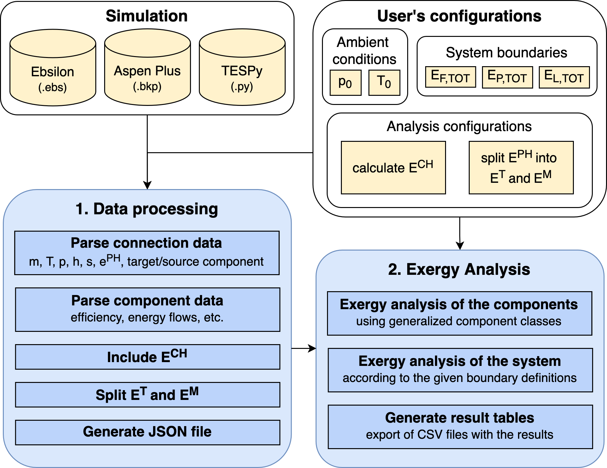

# Summary

This paper presents ExerPy, a flexible and open-source software tool designed for automated exergy analysis of thermodynamic systems. Exergy analysis offers a more comprehensive understanding of energy conversion processes by accounting for both the quantity and quality of energy, thus revealing the inherent inefficiencies that traditional energy balance methods overlook. ExerPy addresses the limitations of existing commercial and open-source simulation tools by integrating both physical and chemical exergy calculations within a unified, Python-based framework. The tool seamlessly interfaces with established simulation environments, including Aspen Plus, Ebsilon Professional, and TESPy, through a standardized JSON interface. This capability allows engineers and researchers to perform in-depth analyses of various energy conversion systems, ranging from simple cycles to complex power plants. Importantly, ExerPy automates the identification of system components and the assignment of exergy balances at both the component and system levels, effectively streamlining the analysis process. The resulting analysis provides detailed metrics, such as exergy destruction and exergetic efficiency, which are essential for pinpointing sources of inefficiency and guiding optimization efforts. A comprehensive validation is demonstrated through the application of ExerPy to a combined cycle power plant, where the tool accurately identifies inefficiencies in key components such as the combustion chamber and gas turbine subsystem. By offering detailed insights into the performance of energy systems, ExerPy supports both academic research and industrial applications, facilitating more sustainable and resource-efficient energy conversion processes.

# Statement of need

Exergy analysis is an effective tool for evaluating and optimizing thermodynamic systems. Unlike conventional energy analysis, which accounts for the quantity of energy but neglects the quality and potential to provide useful work, exergy analysis provides deeper insights by considering both the quantity and quality of energy forms. This approach allows for a better understanding of where and why thermodynamic inefficiencies arise within a system. By quantifying irreversibilities that lead to exergy destruction and identifying their specific sources, engineers and researchers can develop strategies to improve efficiency, reduce costs, and support more sustainable energy conversion `@Tsatsaronis_1993`. This makes exergy analysis a valuable tool not only for evaluating but also for designing and optimizing sustainable energy-conversion systems that prioritize sustainability and resource efficiency `@Meyer_2008, petrakopoulou2017improving`. 

Despite its advantages, exergy analysis is not yet widely integrated into most commercial software used for thermodynamic assessments, which primarily focus on energy and mass balance calculations. Simulation tools like Aspen Plus\textregistered and Ebsilon Professional\textregistered offer comprehensive frameworks for modeling energy flows, but lack the built-in functionality needed to realize detailed exergy analysis. This limitation reduces their effectiveness in evaluating system performance from a second-law perspective, where the focus is on minimizing irreversibilities and maximizing the useful products extracted from energy sources. For example, while these tools provide basic physical exergy calculations for process streams, they do not account for factors, such as chemical exergy, leading to an incomplete assessment of system inefficiencies. Furthermore, the proprietary nature of these tools restricts customization, making it challenging to implement advanced exergy-based optimization approaches. This shortcoming has been partially solved in the open-source software TESPy `@Witte_2020`, where a generalized implementation of the exergy analysis was integrated for both physical `@Witte_2022` and chemical exergy `@Hofmann_2022_ECOS`. While these implementations represent meaningful progress, they still face notable limitations: they rely heavily on user input, are tied to specific software, and lack interoperability with other open source or commercially available tools. These shortcomings have driven demand for specialized, user-friendly, automated open-source software that integrates exergetic methods and works across commercial and open-source tools. 

To address this gap, ExerPy builds on the TESPy implementation and offers a flexible, Python-based solution that automates exergy analysis of energy-conversion systems modeled in commercial software via a JSON-datatype interface. It also includes an API to automatically connect to Aspen Plus\textregistered, Ebsilon Professional\textregistered, or TESPy. ExerPy integrates the physical exergy calculations from these software and adds chemical exergy to provide a more complete analysis. The program autonomously identifies components and assigns exergy balances at the component level, enabling detailed and comprehensive exergy analysis across the entire process. This automation not only streamlines the workflow, making the analysis more efficient and accurate, but also helps identify inefficiencies at both the system and component levels, thereby facilitating the optimization of energy-conversion systems from an exergy perspective. `@Tsatsaronis_1993`

# Features

ExerPy is designed to perform exergy analysis through a structured workflow that integrates seamlessly with simulation tools. The initial implementation supports Ebsilon Professional\textregistered, Aspen Plus\textregistered, and TESPy. The framework is divided into two main modules: the data processing module, which manages the extraction and preparation of simulation data, and the exergy analysis module, which conducts the detailed exergy calculations. This modular design enhances flexibility and allows users to evaluate systems of varying complexity. The architecture is outlined in the following sections and is shown in Figure \autoref{fig:structure}.

#### Data processing 

The framework begins with the parsing of simulation data from models created in Ebsilon Professional\textregistered, Aspen Plus\textregistered, or TESPy, using the respective functions: `from_ebsilon`, `from_aspen`, and `from_tespy`. It is important to note that the physical exergy, calculated from the entropy and enthalpy of the streams, is parsed directly from the simulation tools. In the cases of `from_ebsilon` and `from_aspen`, the simulation is run and the necessary data are retrieved directly from the respective simulation environments. The integration with TESPy is slightly different: the simulation is performed beforehand within Python. The resulting TESPy simulation is then passed to ExerPy via the `from_tespy` function, which is responsible solely for calculating the exergy values. This allows updating the exergy values in case the ambient state is changed without rerunning the simulation. Independent of the simulation software, users also have the option to supply their own JSON file using `from_json`, which must conform to the required format for exergy analysis. In all cases, these functions instantiate an object of the `ExergyAnalysis` class, which internally calls the \texttt{\_construct\_components} function to build the system network. 

During the parsing process, connection data such as mass flow ($m$), temperature ($T$), pressure ($p$), enthalpy ($h$), entropy ($s$), and physical exergy ($e^\text{PH}$) are parsed, along with the identification of target and source components. In addition, component data including efficiency, energy flows, and other relevant thermodynamic properties are also extracted. Ambient conditions are taken directly from the simulation, or they can be specified by the user manually. 

ExerPy also allows splitting the physical exergy into thermal ($e^\text{T}$) and mechanical ($e^\text{M}$) parts. This separation enables a more comprehensive analysis of thermodynamic processes, especially for components operating below ambient temperature `@morosuk2019splitting`. These values are calculated using the native property functions of the simulation tools. In the initial release of ExerPy, this separation is not yet available in Aspen Plus due to limited access to thermodynamic functions, but it is planned for a future update.

After the data parsing is complete, ExerPy calculates the chemical exergy ($e^\text{CH}$) of each material stream based on their molar or mass composition. The approach is adapted from TESPy `@Hofmann_2022_ECOS` and the specific chemical exergy of each stream is calculated in ExerPy based on the thermodynamic reference environment developed by Ahrendts `@Ahrendts_1977`. For pure substances, the specific chemical exergy is taken directly from tabulated data of the chosen thermodynamic model, while for mixtures like air or flue gas, the chemical exergy is calculated based on the values of individual components. This involves using molar fractions and assuming ideal behavior when the mixture is gaseous, with adjustments made for mixtures including condensable components (e.g., water) to account for both gas and liquid phases. The evaluation of chemical exergy is performed only if the user explicitly specifies it. However, it is important to note that its use becomes indispensable for systems involving chemical reactions or mixing processes, where chemical exergy variations are significant. Finally, all parsed and calculated data are consolidated into a standardized JSON file, independent of the simulation tool used, which includes all the necessary information for a comprehensive exergy analysis.

#### Exergy Analysis

The framework performs exergy analysis at both the component and system levels. Each component of the system—such as turbines, compressors, and heat exchangers—is represented by a Python class that automatically assigns the exergy of the fuel and exergy of the product of the component. Using these definitions, ExerPy calculates relevant metrics for each component (i.e., the exergy destruction and exergetic efficiency). This offers detailed insights into the inefficiencies of each individual component and enables targeted optimization. Furthermore, thanks to the class based structure it is possible, that the user to define custom (external) component classes specific to their problem along with their respective exergy balance equations. The component can then be registered to the ExerPy package using the \texttt{@component\_registry} decorator to be included in the automated evaluation. At the system level, the total exergy balance is determined by evaluating the exergy of streams crossing the system boundaries. To perform this analysis, and in the current release, it is necessary for the user to define the streams representing the exergy of the product, the exergy of the fuel, and exergy loss of the overall process. Further automation is planned for future versions of the platform. The system-level exergy analysis yields the overall exergetic efficiency and the total exergy destruction of the overall system. Finally, the framework offers the possibility to export the results as CSV files for further examination and integration into additional workflows. 

# Use Case and validation

In this study, a combined-cycle power plant (CCPP) is analyzed to demonstrate the capabilities of the ExerPy framework for detailed exergy analysis. The analyzed CCPP integrates a gas turbine system (GT) with a steam cycle to optimize energy conversion efficiency. The plant is designed to deliver \SI{300}{MW} net electrical power, with \SI{248}{MW} generated in the gas turbine, and \SI{100}{MW} of thermal energy. The gas turbine system operates with a turbine inlet pressure of \SI{15}{bar} and an inlet temperature of \SI{1150}{\celsius}. The heat recovery steam generator (HRSG) generates steam at \SI{50}{bar} and \SI{505.6}{\celsius}, maintaining a minimum temperature difference of \SI{25}{K} in the superheater.
The steam cycle is split into high- and low-pressure stages. The high-pressure steam turbine expands the steam down to \SI{15}{bar}. A portion of the expanded steam is extracted and condensed to provide heat, another portion is sent to the deaerator, and the rest passes through the low-pressure steam turbine. In the low-pressure steam turbine, the steam is further expanded and then condensed in the condenser (COND) using cooling water at ambient conditions. The electrical efficiency of the system is 48.5\%. When coupled with the heat extraction process, the overall energetic efficiency of the system is 64.7\%.

The results of the exergy analysis of the CCPP simulated with Ebsilon Professional\textregistered~are shown in \Cref{tab:exergy-analysis}. The exergy destruction is calculated for all components of the system based on their exergy balance equation. Since the condenser is a dissipative component, its exergy product and fuel are not defined. 

The combustion chamber (CC) is the component with the most significant exergy destruction and has the greatest impact on system performance. Together with the expander and the air compressor (COMP), the GT system accounts for approximately 88\% of the exergy destruction in the overall plant.

| Component | $\dot{E}_\mathrm{F}$ [MW] | $\dot{E}_\mathrm{P}$ [MW] | $\dot{E}_\mathrm{D}$ [MW] | $\dot{E}_\mathrm{L}$ [MW] | $\varepsilon$ [%] | $y$ [%] | $y^*$ [%] |
|-----------|---------------------------|---------------------------|---------------------------|---------------------------|------------------|---------|-----------|
| CC        | 632.23                    | 436.46                    | 195.77                    | --                        | 69.04            | 30.52   | 76.98     |
| COMP      | 241.98                    | 231.04                    | 10.95                     | --                        | 95.48            | 1.71    | 4.30      |
| COND      | --                        | --                        | 3.72                      | --                        | --               | 0.36    | 0.92      |
| DEA       | 8.20                      | 6.44                      | 1.76                      | --                        | 78.51            | 0.28    | 0.69      |
| ECO       | 13.42                     | 11.95                     | 1.48                      | --                        | 89.01            | 0.23    | 0.58      |
| EVA       | 74.13                     | 62.48                     | 11.65                     | --                        | 84.29            | 1.82    | 4.58      |
| GEN1      | 251.83                    | 248.05                    | 3.78                      | --                        | 98.50            | 0.59    | 1.49      |
| GEN2      | 53.25                     | 52.45                     | 0.80                      | --                        | 98.50            | 0.13    | 0.31      |
| GT        | 509.78                    | 493.81                    | 15.97                     | --                        | 96.87            | 2.49    | 6.28      |
| HC        | 39.72                     | 39.72                     | 0.00                      | --                        | 100.00           | 0.00    | 0.00      |
| MIX       | 3.09                      | 1.67                      | 1.42                      | --                        | 53.99            | 0.22    | 0.56      |
| MOT1      | 0.04                      | 0.04                      | 0.00                      | --                        | 98.50            | 0.00    | 0.00      |
| MOT2      | 0.46                      | 0.46                      | 0.01                      | --                        | 98.50            | 0.00    | 0.00      |
| PUMP1     | 0.04                      | 0.03                      | 0.01                      | --                        | 81.17            | 0.00    | 0.00      |
| PUMP2     | 0.46                      | 0.40                      | 0.06                      | --                        | 87.30            | 0.01    | 0.02      |
| SH        | 33.35                     | 29.01                     | 4.35                      | --                        | 86.97            | 0.68    | 1.71      |
| ST1       | 28.46                     | 27.47                     | 1.00                      | --                        | 96.50            | 0.16    | 0.39      |
| ST2       | 28.78                     | 25.78                     | 3.00                      | --                        | 89.58            | 0.47    | 1.18      |
| **TOT**   | **641.45**                | **339.72**                | **254.32**                | **47.41**                 | **52.96**        | **39.65**| **100.00**|

The following specifications are used in the exergy analysis of the overall plant:
\begin{align}
    & \dot{E}_\mathrm{F} = \dot{E}_1 + \dot{E}_3 \\
    &\dot{E}_\mathrm{P} = \dot{W}_\mathrm{el,net} + \dot{E}_\mathrm{q} \\
    &\dot{E}_\mathrm{L} = \dot{E}_8 + \dot{E}_{15} - \dot{E}_{14} 
\end{align}
where, $\dot{W}_\mathrm{el,net}$ is the net electric power and $\dot{E}_\mathrm{q}$ is the exergy related to the extracted heat flow rate. The value of $\dot{E}_\mathrm{q}$ is determined as the difference between the thermal exergy of the inlet and outlet streams. The temperature level at which the heat is transferred is not specified since the cold stream is not simulated in this example. 

The system results in an exergetic efficiency of approximately 53\%, which is comparable to values reported in the literature `@petrakopoulou2012conventional, ersayin2015performance, ameri2008exergy`. The exergy product amounts to around \SI{340}{MW}, with \SI{300}{MW} attributed to electric power and the remaining \SI{40}{MW} to thermal energy. The exergy analysis of the entire system shows that the exergy of the product is considerably lower than the energy of the product due to the low exergy value of the heat output (25.0\%). This underscores the significance of incorporating exergy calculations when assessing and comparing product of different quality.

The results of the exergy analysis of the CCPP simulated with Aspen Plus\textregistered~and with TESPy show a maximum difference of 1\% compared to the simulation results from Ebsilon Professional\textregistered, validating the accuracy and confirming the flexibility of the tool. Additional applications of ExerPy, such as the CGAM process `@Valero_1994` and a heat pump, are also provided in the Git repository.

# Nomenclature
| Abbreviation | Description | Abbreviation | Description |
|--------|-----------------------------------|--------|-------------------------------------|
| CC     | Combustion chamber                | CCPP   | Combined cycle power plant          |
| COMP   | Compressor                        | COND   | Condenser                           |
| DEA    | Deaerator                         | ECO    | Economizer                          |
| EVA    | Evaporator                        | GEN    | Generator                           |
| GT     | Gas turbine expander              | HC     | Heat consumer                       |
| MIX    | Mixer                             | PUMP   | Pump                                |
| SH     | Superheater                       | ST     | Steam turbine                       |
| TESPy  | Tool for energy system simulation in Python |        |                                     |

| Symbol | Meaning             | Symbol | Meaning               |
|--------|---------------------|--------|-----------------------|
| 0      | Ambient state       | CH     | Chemical (exergy)     |
| D      | Destruction         | F      | Fuel                  |
| i      | Component index     | L      | Loss                  |
| M      | Mechanical (exergy) | P      | Product               |
| PH     | Physical (exergy)   | T      | Thermal (exergy)      |

| Symbol       | Meaning                     | Symbol     | Meaning                          |
|--------------|-----------------------------|------------|----------------------------------|
| $\dot{E}$    | Exergy rate [MW]            | $h$        | Enthalpy [kJ/kg]                |
| $m$          | Mass flow rate [kg/s]       | $p$        | Pressure [bar]                  |
| $s$          | Entropy [kJ/(kg·K)]         | $T$        | Temperature [°C]                |
| $\dot{W}$    | Power rate [MW]             | $y,\,y^*$  | Exergy yield parameters [%]     |

| Symbol           | Meaning                       | Symbol | Meaning                       |
|------------------|-------------------------------|--------|-------------------------------|
| $\varepsilon$    | Exergetic efficiency [%]      | $\eta$ | Energetic efficiency [%]      |

# Acknowledgements

Parts of this work have been funded by the German Federal Ministry for Economic Affairs and Climate Action through the research project SecöndLife, grant number 03EI1076A.

# References